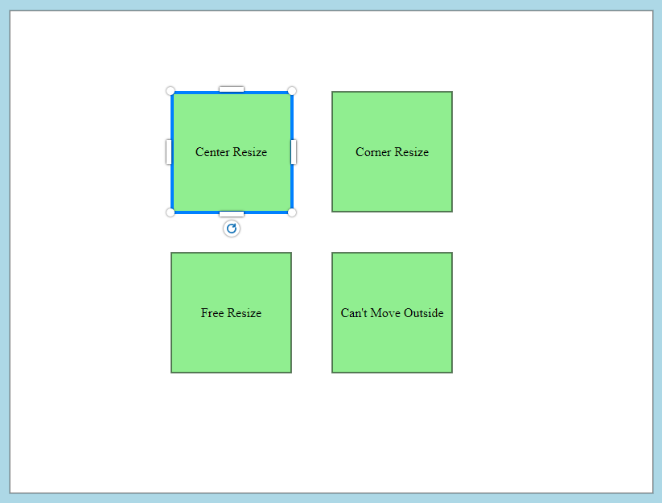

# Move Rotate Resize Handler JavaScript
## [DEMO](https://bh8q3.csb.app/) 
## resizer.js and resizer.css 
### A simple javascript object that provide easy way to make any dom element resizable. It provide handles to move, resize and rotate target element.

## How to install
    npm install move-rotate-resizer

## [download from gitHub](https://github.com/developergovindgupta/move-rotate-resizer)
### [resizer.js](https://raw.githubusercontent.com/developergovindgupta/move-rotate-resizer/master/resizer.js)
### [resizer.min.js](https://raw.githubusercontent.com/developergovindgupta/move-rotate-resizer/master/resizer.min.js)
### [resizer.css](https://raw.githubusercontent.com/developergovindgupta/move-rotate-resizer/master/resizer.css)

## [DEMO](https://codesandbox.io/s/move-rotate-resizer-demo-bh8q3) 

## How to use
    import resizer from 'move-rotate-resizer';
    or
    import resizer from './js/resizer.min.js';
    or
    <link rel="stylesheet" href="resizer.css" />
    

## Usase Example-1

    resizer.add(document.getElementById('div1'));

## Methods and Descriptions
|Method|Description|
|-|-|
|add(target [,options])|add target dom element to resizer. it register event listener.|
|remove(target)|remove target dom element from resizer. it remove all event listener.|
|show(target)|show resizer handler on target dom element by javascript code.|
|hide()|hide resizer handler by javascript code.|

## Properties and Descriptions
|Propery|Description|
|-|-|
|target|return current selected target dom element|
|resizer|return resizer handlers dom element|
|hoverLine|return resizer hoverLine dom element|

## Dom Element Attribute
|Attribute|Description|
|-|-|
|isLocked|"true" then resize handler can not change the target position or size|
|isDisabled|"true" then resize handler not visible|

## Options passed with add method
    let options = {
        minWidth: 30,               // minimum width in px
        minHeight: 30,              // minimum height in px
        aspectRatio: true,          // if true width height ratio will maintain
        resizeFromCenter: false,    // if true then resize both side from center
        onDragStart: null,          // call-back function that called when dragging start
        onDragging: null,           // call-back function that called every mouse movement till mousedown
        onDragEnd: null,            // call-back function that called when mouse button is released after move
        onResizeStart: null,        // call-back function that called when any resize handler is start dragging
        onResizing: null,           // call-back function that called every mouse movement till musedown
        onResizeEnd: null,          // call-back function that called when release resize handler
        onRotateStart: null,        // call-back function that called when rotate handler is started dragging
        onRotating: null,           // call-back function that called every movement of rotate handler
        onRotateEnd: null,          // call-back function that called when release rotate handler
        onResizerShown: null,       // call-back function that called when resizer is first time shown on target
        onResizerHide: null,        // call-back function that called when resizer is hide on target
        isHideOnResize: true,       // if true then resizer will not visible at the time of dragging so that target visible clearly
        isHoverLine: true,          // if true then target element on mouse hover hoverLine visible for highlight target element
        boundWithContainer:false,   // if true then target element can not move outside the container element.
        resizers: {
            n: true,                // top middle resize handler            true:visible|false:hidden
            s: true,                // bottom middle resize handler
            e: true,                // right middle resize handler
            w: true,                // left middle resize handler
            ne: true,               // top-right resize handler
            nw: true,               // top-left resize handler
            se: true,               // bottom-right resize handler
            sw: true,               // bottom-left resize handler
            r: true,                // rotate handler
        },
    };

### Note callBack function receive an props having properties
|props-property|description|
|-|-|
|size|{left,top,width,height}|
|angle|target element rotate angle|
|evtTarget|resizer target element that call the callback function|
|handler|current resize handler that is draging|

## Example Code
### HTML
    <!DOCTYPE html>
    <html>
    <head>
        <title>move-rotate-resize:demo</title>
        <meta charset="UTF-8" />
        <link rel="stylesheet" href="src/styles.css" />
        <link rel="stylesheet" href="/node_modules/move-rotate-resizer/resizer.css" />
    </head>
    <body>
        <h1>DEMO : move-rotate-resizer</h1>
        <h2>resizer.js and resizer.css</h2>
        

        

        
div1

        
div2

        

    </body>
    </html>
    

### Script [index.js]
    import resizer from 'move-rotate-resizer';

    document.querySelectorAll('.target').forEach((target) => {
        resizer.add(target);
    });

## [DEMO](https://codesandbox.io/s/move-rotate-resizer-demo-bh8q3) 

### download css file and include in your html file.
### [resizer.css](https://raw.githubusercontent.com/developergovindgupta/move-rotate-resizer/master/resizer.css)

## Developed by Govind Gupta
